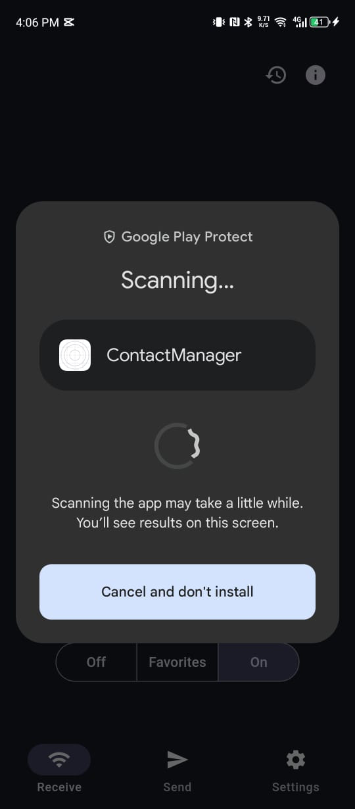

# Contact Manager — Final Demo Application (Build)

**Name:** Lhundup Dorji  
**Module:** SWE201  
**Assignment:** Final Demo Application (Build)

---

## Introduction

This project involves developing a mobile application called **Contact Manager** using React Native with Expo. The main goal of creating this app was to improve my understanding of mobile app development, including UI design, navigation, state management, and local data persistence.

The app helps users manage their personal contacts by allowing them to add, view, edit, and delete contacts. It is designed to be simple, user-friendly, and responsive, with a clean structure that is easy to understand and explain.

---

## Objective of the Project

The objectives of this project are:

- To understand the basic structure of a React Native application
- To develop a mobile app using React Native with Expo
- To implement full CRUD operations (Create, Read, Update, Delete)
- To implement navigation between multiple screens
- To persist data locally on the device using AsyncStorage
- To design a clean and user-friendly interface
- To build and deploy a real APK using EAS Build (Expo Application Services)
- To install and demonstrate the app on a real Android device without Expo Go

---

## Main Entity

### Contact (Primary Entity)

| Field | Type | Description |
|-------|------|-------------|
| id | String | Auto-generated unique ID using Date.now() |
| name | String | Full name of the contact |
| phone | String | Phone number of the contact |

---

## State Management

**Library:** React useState (built-in React hook)

React's built-in `useState` hook was chosen for its simplicity and ease of understanding. Since this is a small application with no complex global state requirements, `useState` is sufficient and clean.

The state manages:
- List of contacts loaded from AsyncStorage
- Input field values (name and phone) in Add and Edit screens

**Why useState instead of Zustand or Redux?**
- It is the simplest approach for a small app
- No extra libraries needed
- Easy to understand and explain
- Perfect for local component-level state

---

## Data Persistence

**Library:** AsyncStorage (@react-native-async-storage/async-storage)

Since this app has no backend, all data is stored locally on the device using AsyncStorage.

**How it works:**
- AsyncStorage stores data as **key-value pairs**
- Data is stored as a **string**, so we use `JSON.stringify()` to convert arrays to strings before saving
- When loading, we use `JSON.parse()` to convert the string back into a JavaScript array
- Data persists even after closing and reopening the app

| Method | Purpose |
|--------|---------|
| `AsyncStorage.setItem(key, value)` | Save data to storage |
| `AsyncStorage.getItem(key)` | Read data from storage |

---

## Build & Deployment

**Service:** EAS Build (Expo Application Services)

EAS Build is Expo's cloud build service that compiles the React Native code into a real Android APK file without needing Android Studio.

**Build Profile used:** `preview` (generates a `.apk` file for direct installation)

**Steps followed:**
1. Configured EAS with `eas build:configure`
2. Built the APK with `eas build -p android --profile preview`
3. Downloaded the APK from the Expo dashboard
4. Installed directly on an Android phone (no Expo Go required)

---

## Navigation Flow

- **Home Screen** → Shows all saved contacts with Edit and Delete buttons
- **Add Contact Screen** → Form to enter name and phone number
- **Edit Contact Screen** → Pre-filled form to update an existing contact

Navigation is implemented using **React Navigation Native Stack Navigator** which uses native animations for smooth screen transitions.

---

## CRUD Operations

| Operation | Screen | How it works |
|-----------|--------|-------------|
| **Create** | AddContactScreen | Creates new contact object with unique ID and pushes to array, saves to AsyncStorage |
| **Read** | HomeScreen | Loads contacts from AsyncStorage every time screen is focused using `useFocusEffect` |
| **Update** | EditContactScreen | Maps through contacts array, replaces matching contact by ID with new data |
| **Delete** | HomeScreen | Filters out contact by ID from array, saves updated array to AsyncStorage |

---

## Dependencies

| Package | Purpose |
|---------|---------|
| expo | React Native framework |
| react-native | Core mobile UI components |
| @react-navigation/native | Navigation container |
| @react-navigation/native-stack | Native stack navigator |
| react-native-screens | Native screen components for navigation |
| react-native-safe-area-context | Handles phone notch and status bar |
| @react-native-async-storage/async-storage | Local data persistence |
| babel-preset-expo | Code transformer for Expo |

---

## Terminal Commands Used

| Command | Purpose |
|---------|---------|
| `npx create-expo-app ContactManager --template blank` | Creates a new blank Expo project |
| `npx expo install <package>` | Installs packages with correct Expo-compatible versions |
| `npm install <package>` | Installs JavaScript packages |
| `npx expo start` | Starts the local development server with QR code |
| `eas login` | Logs into Expo account |
| `eas build:configure` | Links the project to EAS cloud |
| `eas build -p android --profile preview` | Builds APK on Expo cloud servers |

---

## Features

- 📋 List view of all saved contacts
- ➕ Add new contacts with name and phone number
- ✏️ Edit existing contacts with pre-filled form
- 🗑️ Delete contacts with confirmation dialog
- 💾 Data persists locally using AsyncStorage
- 📭 Empty state message when no contacts exist
- 🎨 Clean and simple UI with color-coded avatar initials
- 📱 Real APK installed on Android device (no Expo Go needed)

---

## Challenges Faced

During the development of this project, several challenges were encountered:

- Setting up the correct package versions compatible with Expo 54
- Fixing the app entry point (`main` field in `package.json`)
- Resolving Gradle build errors caused by `newArchEnabled` and `jsEngine` conflicts
- Understanding the difference between `createStackNavigator` and `createNativeStackNavigator`
- Fixing the `babel-preset-expo` missing module error during cloud build
- Ensuring data loads correctly when navigating back using `useFocusEffect`

These challenges were overcome through debugging, reading error logs carefully, and testing different configurations, which helped build a deeper understanding of React Native and Expo development.

---

## Known Limitations

- No backend — all data is stored locally on the device only
- Data is lost if the app is uninstalled
- No search or filter functionality
- No profile photo support for contacts
- Tested on Android only

---

## Conclusion

This project demonstrates a complete mobile CRUD application with a clean UI, proper navigation, and local data persistence using AsyncStorage. It was built and deployed as a real Android APK using EAS Build without requiring Expo Go. The project helped build practical skills in React Native, local storage, navigation, and mobile app deployment that will be useful in future software engineering projects.

---
## ScreenShots

  
  
  
  
  

### Expo Dev Builds

  

---

## Author

- **Name:** Lhundup Dorji
- **Module:** SWE201
- **Class Work:** Final Demo Application (Build)